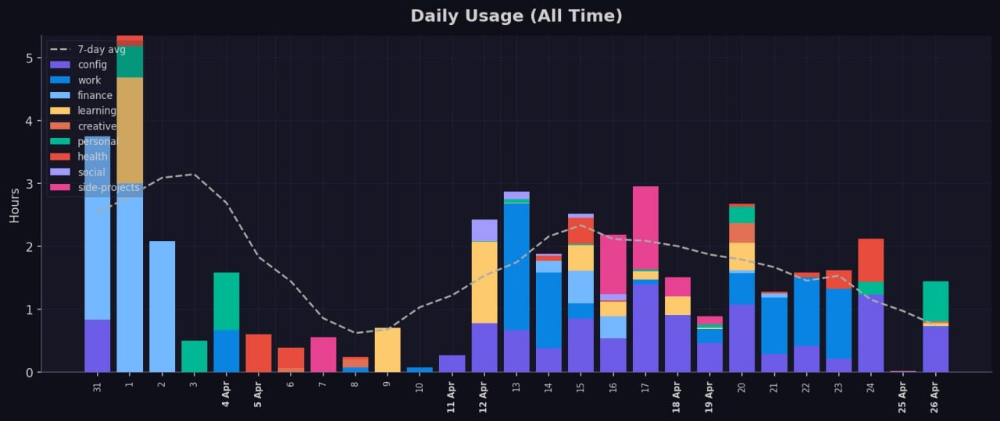
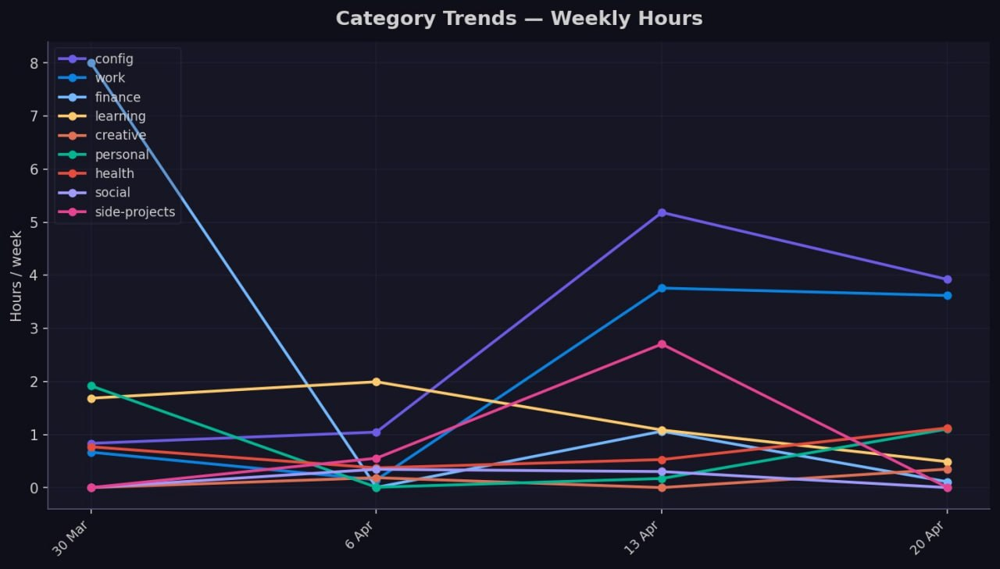
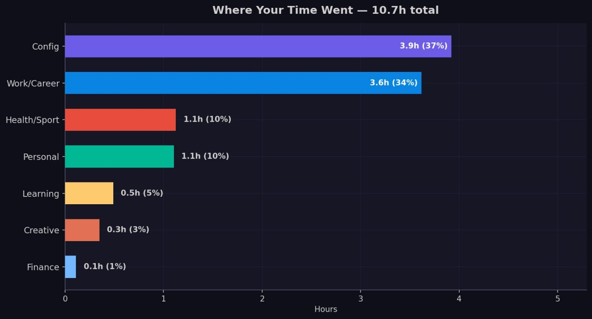

# OpenClaw Skills

A collection of community skills for [OpenClaw](https://github.com/openclaw/openclaw).

## Skills

| Skill | Description |
|-------|-------------|
| [usage-report](usage-report/) | Weekly usage reports with charts from OpenClaw session logs. Tracks time across categories with LLM-powered topic labeling. |

## Screenshots

### Daily Usage (All Time)


### Category Trends — Weekly Hours


### Weekly Breakdown


## Installation

Copy a skill directory into your OpenClaw skills folder:

```bash
# Copy to managed skills
cp -r usage-report/ ~/.openclaw/skills/usage-report/

# Run setup
python3 ~/.openclaw/skills/usage-report/scripts/setup.py
```

Or install from ClewHub (when available):
```bash
openclaw skills install usage-report
```

## License

MIT
